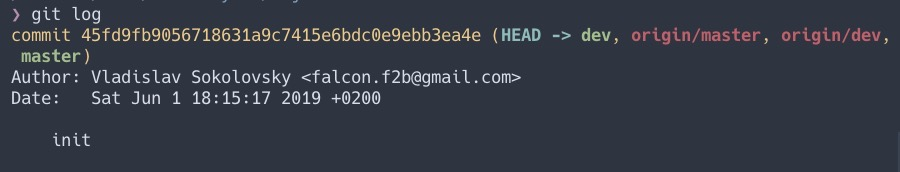

# SoftwareEngineeringLabs2019
> Awesome readme by Svjatoslav Pushyk

[](https://forthebadge.com)[](https://forthebadge.com)[](https://forthebadge.com)[](https://forthebadge.com)[](https://forthebadge.com)[](https://forthebadge.com)[](https://forthebadge.com)

## Student
| **Prop**      |  **Value**   |
| :------------ | :----------: |
| **Name**      | *Svjatoslav* |
| **Last Name** |   *Pushyk*   |
| **Group**     |   *IO-73*    |
| **Year**      |    *2019*    |


## Labs
### Lab1

```
❯ git log
commit 45fd9fb9056718631a9c7415e6bdc0e9ebb3ea4e (HEAD -> dev, origin/master, origin/dev, master)
Author: Vladislav Sokolovsky <falcon.f2b@gmail.com>
Date:   Sat Jun 1 18:15:17 2019 +0200

    init
```


